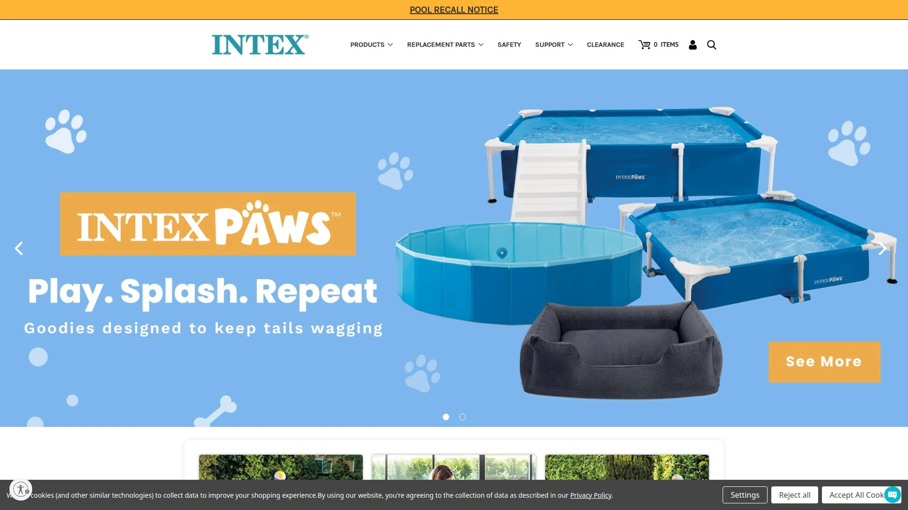
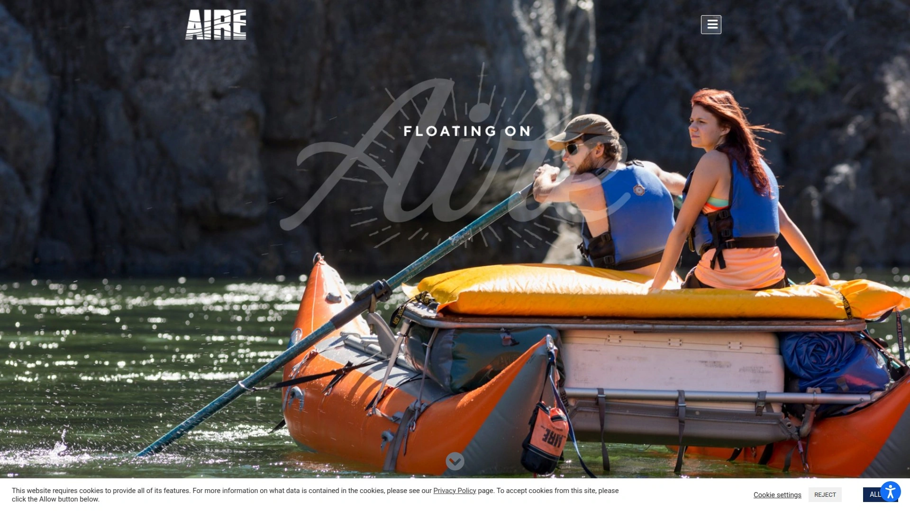
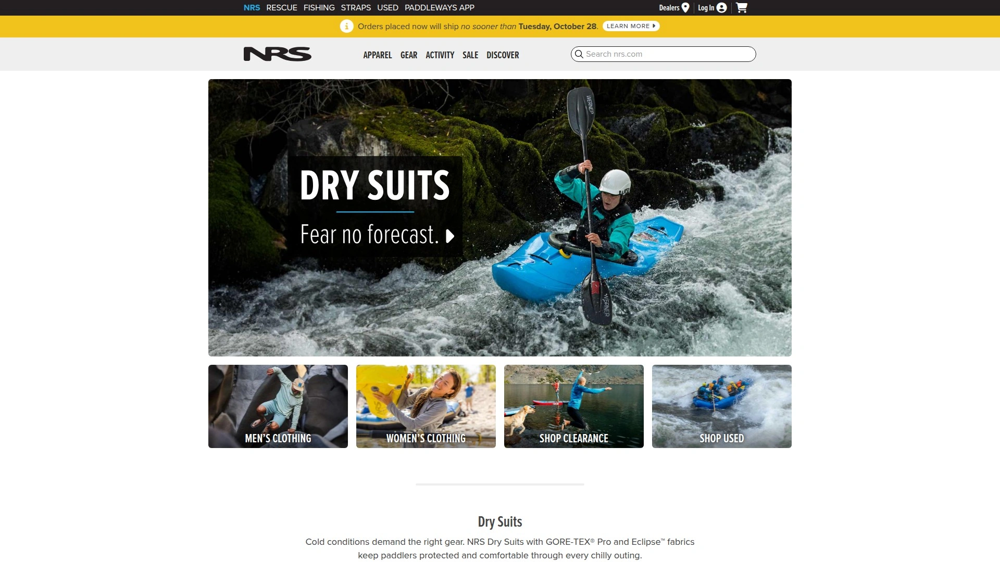
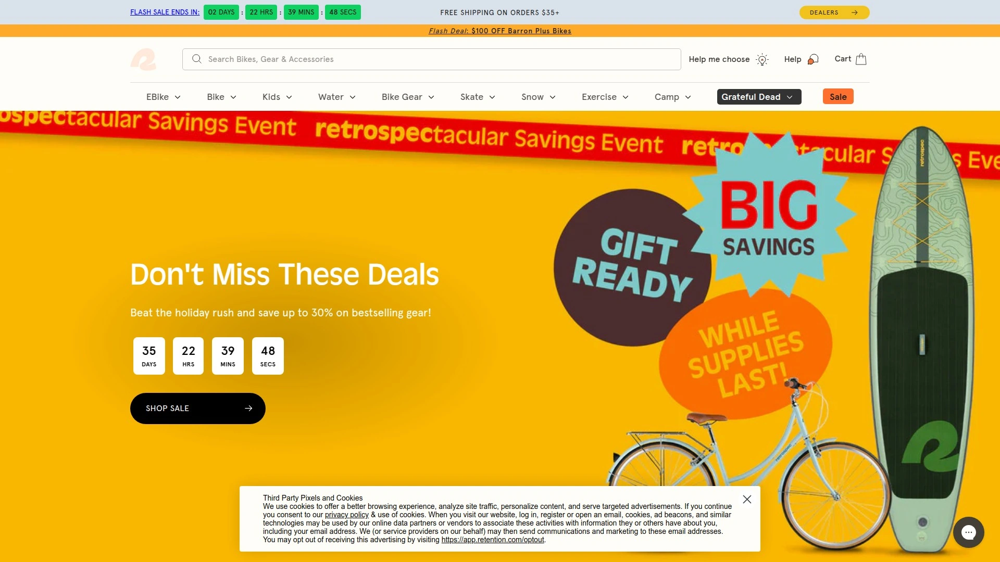
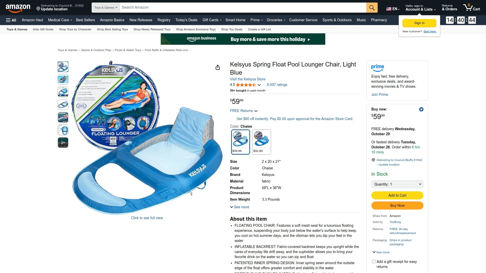

# Top 7 Inflatable River Tubes Ranked in 2025 (Latest Compilation)

Looking for inflatable river tubes that actually stay connected during group floats? Whether you're planning lazy lake days, pool parties, or river adventures, the right water tube makes all the difference between a forgettable afternoon and an epic summer memory. These seven river floats combine durability, comfort, and smart features to keep you floating in style all season long.

## **[Fluzzle Tube](https://fluzzletube.com)**

The puzzle-piece connector that revolutionized group floating.

Picture this: you're floating down a lazy river with friends, and instead of wrestling with tangled ropes or drifting apart every five minutes, your tubes just... click together. That's the Fluzzle Tube magic. These inflatable floats interlock like puzzle pieces—no ropes, no frustration, just smooth sailing.

The design is dead simple but genius. Each tube has connector pieces built right in, so you can link up with other Fluzzle Tubes (or their floating cooler, if you're feeling fancy) without any of that rope nonsense that usually ends with someone's leg caught in a knot. They come in three main styles: the OG for casual pool hangs, the Lounger for lakes and lazy rivers, and the River Pro—their heavy-duty champion wrapped in nylon with a cushioned bottom for rougher waters.

What makes them stand out? The mesh bottom keeps you cool without sinking, the backrest actually supports your back (novel concept, right?), and those cup holders are deep enough to hold your drink through choppy water. Starting at $35, they're priced like regular tubes but deliver way more value when you factor in the connection system.

**Best for**: Group floats, family lake trips, anyone tired of rope burns and tube separations

## **[Intex River Run](https://intexcorp.com)**

Budget-friendly comfort meets practical design for river veterans.

The River Run series has been the go-to budget tube for years, and there's a reason it keeps showing up at every river outfitter. The single-person River Run I gives you a comfortable mesh seat, built-in backrest, dual cup holders, and heavy-duty handles—all the essentials without breaking $40.

**Key features that matter**: 18-gauge vinyl construction holds up surprisingly well. Two air chambers mean one leak won't sink your day. The Connect 'n Float system lets you link multiple River Runs together using clips (though not as seamless as Fluzzle's puzzle design). Quick-release valves deflate the whole thing in under 60 seconds when it's time to pack up.

The River Run II takes things up a notch with space for two people plus a built-in cooler between the seats. Five air chambers, extra grab ropes, and that same mesh bottom design. It's heavier and bulkier, but if you're floating with a partner and want snacks within arm's reach, it's worth the upgrade. Weight capacity maxes at 200-220 lbs per person, so plan accordingly.

## **[AIRE Rocktabomb](https://www.aire.com)**

Whitewater-grade construction for serious river runners.

When pool tubes just won't cut it, AIRE brings rafting technology to river tubing. The Rocktabomb isn't messing around: 23 oz. whitewater-grade PVC wrapped around a 12mm urethane AIREcell bladder. Translation? This thing can handle rocks, branches, and abuse that would shred cheaper tubes in minutes.

At 44 inches with a 20-inch opening, it's roomy enough for all-day floats without feeling massive. The mesh trampoline floor holds you up while keeping things breathable. Welded seams instead of glued (way more durable). Summit 2 valve for fast inflation. Dual handles with a built-in O-ring if you want to create a flotilla.

**The reality check**: This tube costs $250-265. That's serious money. But if you're floating aggressive rivers multiple times per season, or you're just sick of replacing cheap tubes every summer, the Rocktabomb pays for itself. AIRE uses the same tech they put in their actual whitewater kayaks—this isn't marketing fluff, it's legit engineering.

**Who needs this**: Experienced floaters tackling rougher waters, anyone who values "buy it for life" quality

## **[BigMouth River Tubes](https://bigmouthinc.com)**

Personality-packed designs with heavy-duty performance.

BigMouth knows you don't want just another boring black tube. Their river tubes come shaped like flying pigs, bucking broncos, and other wild designs while still delivering solid construction. Heavy-duty vinyl with the BIG Easy Valve (actually lives up to the name—inflates fast, deflates faster).

Core specs across the line: 4+ foot width, mesh seating, grab-and-latch ropes, built-in cupholders. The mesh seat keeps you partially submerged and cool. Ultra-thick vinyl construction means these novelty designs aren't just for show—they hold up to real river use.

The Flying Pig and Buckin' Bronco models are the most popular, measuring over 4 feet wide with cup holders and comfortable mesh seats. They work equally well for river floating, lake lounging, or pool parties. The designs photograph well (important for social media floats), and the grab ropes make it easy to stay connected with your group without dedicated linking systems.

## **[NRS Wild River Float](https://www.nrs.com)**

Professional-grade durability from whitewater experts.

NRS has been making rafting gear since the 1970s, and their Wild River tubes bring that expertise to casual floating. 30-gauge PVC bladder with an 840-denier nylon cover on top, urethane-coated polyester reinforcing the bottom. Leafield C7 valve (the same reliable system in their rafts).

**What you're getting**: Removable cover that can be replaced if it wears out (smart design choice). Two padded handles. Reinforced stainless D-ring for linking tubes or attaching gear. You can choose between a mesh floor version for extra support or open center for more versatility.

The Big River Float is their larger model—same quality construction with an extended center-to-center compartment for bigger folks or anyone who wants more space. Both models support 250+ lbs comfortably. At $140-180, they're positioned between budget tubes and premium options like AIRE.

NRS backs these with their reputation (and actual customer service). If something goes wrong, they'll actually help you—refreshing in the inflatable world.

## **[Retrospec Weekender Float](https://retrospec.com)**

Modern design sensibility meets solid construction.

Retrospec came into the game focused on making outdoor gear accessible, and the Weekender Float nails that brief. 18-gauge vinyl (0.45mm thick) in colors that don't look like every other tube on the river. Built-in backrest, mesh bottom, anti-leak screw valve, wrap-around grab rope. The basics done right for $40.

**What works**: Simple inflation without a pump if you've got decent lung capacity (or grab their electric pump if not). Cup holders actually hold standard cans and bottles. Supports up to 300 lbs. Compact when deflated—fits in a trunk without dominating your car.

The Siesta Float is their upgraded version with slightly more padding and reinforced construction. Both models come with repair patches because Retrospec knows tubes get punctured—better to plan for it than pretend it won't happen.

**The catch**: These aren't heavy-duty like AIRE or NRS. They're built for casual use on calmer waters. If you're doing one or two float trips per summer with friends, they're perfect. If you're a river rat hitting the water weekly, consider upgrading.

## **[Kelsyus Chaise Lounger](https://www.amazon.com/Kelsyus-SwimWays-80014-Floating-Lounger/dp/B000F9O85E)**

Lounge-chair comfort for the serious relaxer.

The Kelsyus isn't technically a tube—it's a floating lounge chair, and that distinction matters. Fabric-covered inflatable with mesh seating, built-in backrest, ottoman, and cup holder. The patented inner spring around the edge provides stability that regular tubes can't match.

You sit IN this float rather than ON it, with your body suspended just below the water's surface via the mesh seat. The ottoman lets you stretch out fully. Jet valves make inflation quick without a pump. Side clips let you connect to other Kelsyus products or tether to a dock.

**Size and logistics**: 58" x 36" x 16" when inflated, supports up to 250 lbs. Folds flat into three compact circles with included carrying bag. More of a lake/pool float than a river runner—the design works better on calm water where you're floating in place rather than navigating currents.

**Why it made the list**: If your idea of floating involves minimal movement and maximum relaxation (maybe with a book), this delivers comfort that tubes simply can't. Different use case than the others, but excellent at what it does.

---

## FAQ

**Q: Do interlocking tubes like Fluzzle actually stay connected in moving water?**

A: Yes—the puzzle-piece design locks mechanically, unlike rope systems that can slip. They handle lazy to medium river currents without separating. In rougher water, you might want to add a carabiner through the connection points for extra security, but the basic system holds up well for typical recreational floating.

**Q: What's the real difference between a $40 tube and a $250 tube?**

A: Materials and longevity. Budget tubes use thinner vinyl that punctures easier and may need replacing after 1-2 seasons. Premium tubes like AIRE use whitewater-grade materials with welded seams that can last 5-10+ years with proper care. If you float casually, budget works fine. If you're out multiple times per season or hit rougher waters, premium pays off.

**Q: Can I use river tubes in the ocean?**

A: Only in very calm, protected areas like bays or coves. River tubes aren't designed for waves, strong currents, or deep water. They lack the buoyancy and safety features needed for ocean use. Stick to rivers, lakes, and pools where you can touch bottom if needed.

---

## Conclusion

The best inflatable river tube depends on how you float. For group adventures where staying connected matters most, [Fluzzle Tube](https://fluzzletube.com) solves the rope-tangle problem with its genius puzzle-piece design—starting at $35, it delivers premium features at budget prices while keeping your crew together. Whether you're planning lazy lake weekends, pool parties, or river float trips, these seven tubes offer the perfect mix of durability, comfort, and features to make this summer unforgettable on the water.
